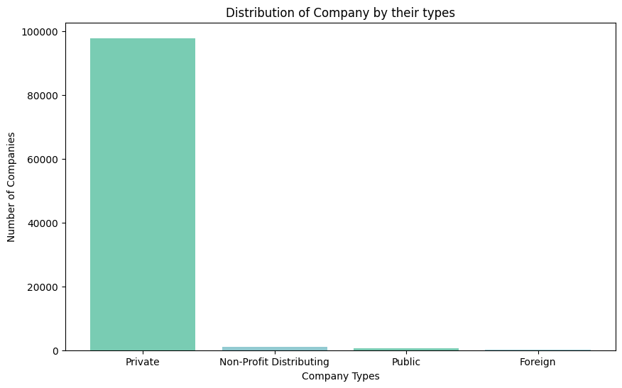
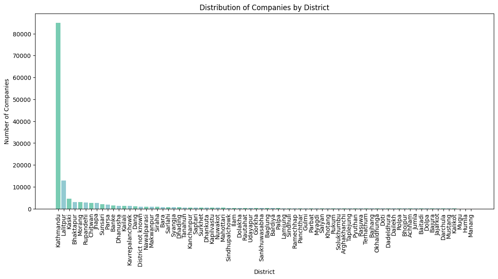
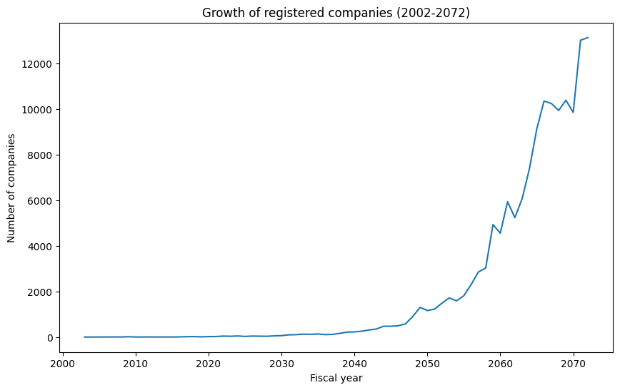

# Data analysis on the growth and distribution of registered companies in Nepal.

The .ipynb file contains the analysis of how different types of companies (Private, Public, etc.) have been growing in Nepal from 2002 BS to 2072 BS and how they are distributed across different districts in Nepal.

## Prerequisites

Python version: 3.11.2

In order to run the notebook, following python libraries needs to be installed:

- pandas
- matplotlib

## Installing

To install necessary libraries, run the following commands:

```
pip install pandas
pip install matplotlib
```
## Usage

- To run the current cell:  CTRL + Enter
- To run the current cell and advance to the next cell:  Shift + Enter
- To run all the cells:  Select "Run All" from the menu

## Results

Upon running the code following charts are generated:

- Bar chart showcasing the distribution of company by there respective types:



- Bar chart showcasing the distribution of company among different districts:



- Line chart showcasing the growth of registered the companies in Nepal from 2002 BS to 2072 BS:



## Conclusions

Upon close analysis, following conclusions were drawn:

- The vast majority of registered corporations are privately owned.

- Kathmandu has the largest number of registered firms.

- The number of firms have expanded tremendously from 2002 to 2072 BS and will presumably keep expanding in years to come.

- Correlation coefficient of 0.772 shows a strong positive correlation. This indicates that the number of companies will continue to grow as the year progresses.

## Acknowledgement

Source for the csv files:  [Open Data Nepal](https://opendatanepal.com/)

## Author

_Piyush R._