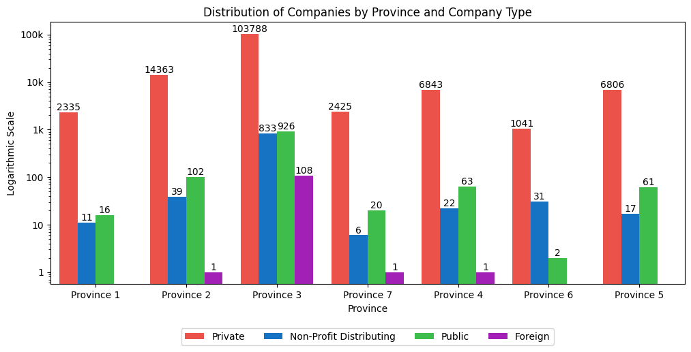
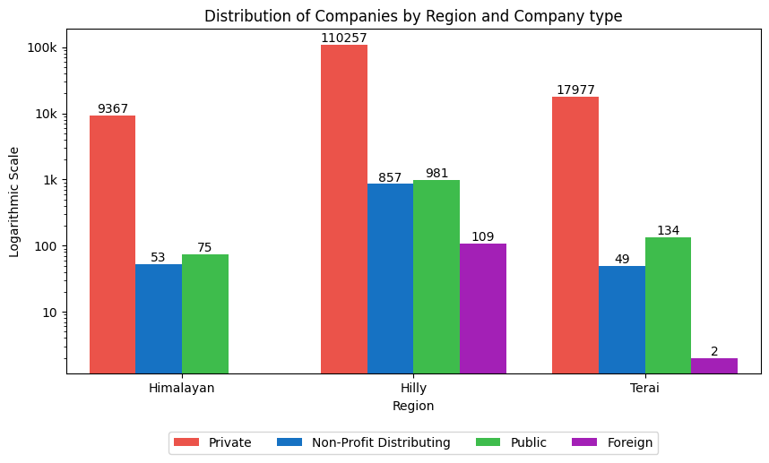
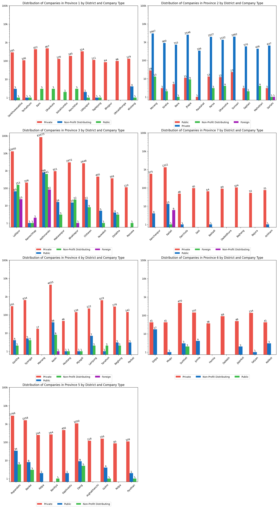
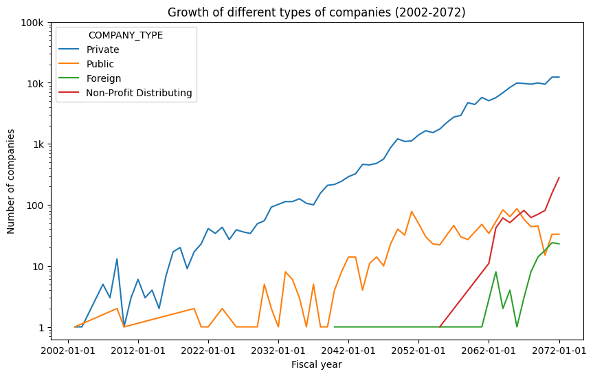

# Data analysis on the growth and distribution of registered companies in Nepal.

The .ipynb file contains the analysis of how different types of companies (Private, Public, etc.) have been growing in Nepal from 2002 BS to 2072 BS and how they are distributed across different districts in Nepal.

## Prerequisites

Python version: 3.11.2

In order to run the notebook, following python libraries needs to be installed:

- pandas
- matplotlib

## Installing

To install necessary libraries, run the following commands:

```
pip install pandas
pip install matplotlib
```
## Usage

- To run the current cell:  CTRL + Enter
- To run the current cell and advance to the next cell:  Shift + Enter
- To run all the cells:  Select "Run All" from the menu

## Results

Upon running the code following charts are generated:

- Bar chart showcasing the distribution of company by there respective types:


- Bar chart showcasing the distribution of different types of companies by their respective provinces:



- Bar chart showcasing the distribution of different types of companies by their respective regions:



- Array of bar charts showcasing the distribution of companies by their respective destricts in each region:


- Array of bar charts showcasing the distribution of different type of companies by their respective destricts in each province:



- Line chart showcasing the growth of registered companies in Nepal from 2002 BS to 2072 BS:


- Line chart showcasing the growth of different type of registered companies in Nepal from 2002 BS to 2072 BS:



## Conclusions

Each of these visualizations highlighted the following trends and conclusions:

- The great majority of registered corporations are owned by individuals.

- Kathmandu has the most registered businesses.

- In terms of the number of registered enterprises, Bagmati province is the most developed, while Karnali province is the least developed.

- In terms of the number of firms, the hilly region is the most developed, while the Himalayan region is the least developed.

- Manang is the least developed district, with only 17 registered businesses, while Kathmandu is the most developed, with 84994 registered businesses as of 2072 BS.

- During its early years, Sankhuwasabha was a prominent location for company formation in a Himalayan area. 

- The number of enterprises has increased dramatically from 2002 to 2072 BS and is expected to continue to grow in the coming years. 

- Correlation coefficient of 0.773 shows a strong positive correlation. This indicates that the number of companies will continue to grow as the year progresses.

## Acknowledgement

Source for the csv files of company registration date by their respective districts:  [Open Data Nepal](https://opendatanepal.com/)

## Author

_Piyush R._